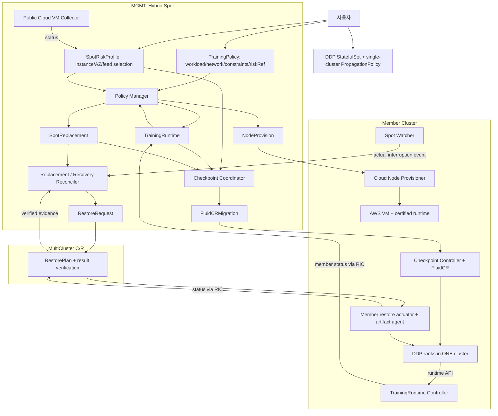

# 아키텍처, 구현 범위, Workflow 및 PPT 자료

기준: 2026-09-29, restore-automation-20260928 브랜치.
이 문서는 목표 설계와 현재 구현을 구분한다. 코드 테스트 통과는 클라우드
통합 검증 완료를 의미하지 않는다. 배포는 [검증 가이드](release-validation-20260929.md)를 따른다.

## 1. 시스템 경계

| 시스템 | 위치 | 책임 | 하지 않는 일 |
|---|---|---|---|
| Hybrid Spot VM Management System | MGMT + member 관측기 | 위험/가격 관측, 사용자 정책 해석, VM 구성 결정, 체크포인트 요청, 교체 의도와 검증 결과 소비 | 직접 CRIU 실행, VM API 직접 호출 |
| MultiCluster Checkpoint/Restore System | MGMT, Karmada API 이용 | RestoreRequest/RestorePlan, 대상 및 아카이브 계획, member 결과 집계와 검증 | 위험률 계산, 사용자 클라우드 정책 결정 |
| Checkpoint/Restore System | member + 학습 Pod | FluidCR 앱 체크포인트/재개, 컨테이너 체크포인트, export/stage/hash, source fencing, restore 실행 | Spot/OnDemand 비율 결정 |
| Cloud Node Provisioner | AWS member의 controller + AWS API | NodeProvision에 따른 VM 생성/join, 런타임 준비/검증, fencing 및 삭제 | 학습 정책이나 체크포인트 주기 계산 |

Stateful-Migration-System 저장소에는 MultiCluster와 member C/R 역할이 함께 있다.
저장소 이름과 논리 시스템 경계는 일대일이 아니다. Karmada RIC은 CR 상태
반영/집계 계약이며 VM 생성기나 CRIU 실행기가 아니다.

RIC arrows describe data flow, not direct network calls between every box.
Whole-world onprem capacity reservation/automatic initial burst is a target extension,
not an implemented box hidden inside this diagram.

## 2. CR 작성자

| CR | spec 생성/관리 | status 관측/관리 |
|---|---|---|
| TrainingPolicy | 사용자: workload UID, 네트워크, 용량/정책 제약, riskProfileRef | Policy Manager/Coordinator의 담당 하위 상태 |
| SpotRiskProfile | 사용자: provider/region/AZ/type, feed 또는 실험 static 입력 | Public Cloud VM Collector |
| TrainingRuntime | Policy Manager, workload/policy UID에 결속 | member Runtime Controller, Karmada RIC 집계 |
| SpotReplacement | Policy Manager의 UID-bound 교체 결정 | Replacement reconciler |
| SpotRecovery | 기존 복원 검증 연계 recovery 경로; 실제 watcher 이벤트와 동일 개념이 아님 | Recovery reconciler |
| FluidCRMigration | Hybrid Spot 자동 경로에서는 Coordinator 단일 작성자 | member Checkpoint Controller, artifact evidence 경로 |
| RestoreRequest | Hybrid Spot replacement/group/recovery 실행 경로 | MultiCluster C/R management |
| RestorePlan | MultiCluster C/R management | member actuator/artifact, RIC |
| NodeProvision | Policy/Replacement가 VM 의도를 작성 | Cloud Node Provisioner, RIC |
| NodeProvisionNetConfig | 운영자: bootstrap/cluster/runtime 설정 | Provisioner가 소비 |

선점위험률은 TrainingPolicy에 복제하지 않는다.
SpotRiskProfile.status를 참조하며, instance/AZ와 최신성/출처를 검증한다.
예측 위험률과 Spot Watcher의 실제 중단 통보는 서로 다른 입력이다.

## 3. Workflow

### A. 신규 AWS DDP 배포
1. 사용자가 workload와 단일 AWS 배치 정책, SpotRiskProfile, TrainingPolicy를 생성한다.
2. Policy Manager가 실제 workload UID와 ResourceBinding을 확인하고 TrainingRuntime을 생성한다.
3. Collector의 유효한 위험/가격과 사용자 제약으로 초기 VM 구성을 결정한다.
4. NodeProvision을 member에 전파하고 Provisioner가 VM/join/런타임을 준비한다.
5. 학습 Pod가 실행되고 Runtime Controller가 rank, session, progress, timing을 수집한다.

초기 checkpoint/restore 비용이 없어도 3~4단계를 진행한다. 단, 누락/오래된
위험률이나 잘못된 workload identity를 임의의 0으로 대체하지 않는다.
현재는 사용자가 AWS를 초기 sourceCluster로 지정한다. 온프레미스 부족 판단과
원자적 예약 후 자동 AWS 선택은 추가 구현 대상이다.

### B. 주기 체크포인트
1. Coordinator가 workload/runtime/risk/진행 중 작업을 확인한다.
2. 측정 전에는 제한된 초기 주기, 측정 후에는 사용 가능한 계산 경로를 선택한다.
3. FluidCRMigration 생성 → 앱 checkpoint-ready → 컨테이너 checkpoint → 파일 증거.
4. 일반 주기 작업은 in-place resume 후 학습 progress를 확인한다.
5. partial 작업의 archive Completed는 유지하고 survivor 재개 상태는 별도 condition으로 기록한다.

### C. Spot → OnDemand 계획 교체
1. Policy Manager가 source NodeProvision UID에 결속된 SpotReplacement를 생성한다.
2. Replacement는 대체 용량을 준비하고 Coordinator가 해당 operation의 partial checkpoint를 만든다.
3. survivor 정지 증거와 target archive/export/hash를 확보한다.
4. MultiCluster C/R이 RestorePlan을 만들고 target artifact 검증 후 기존 source UID를 fencing한다.
5. 새 Pod에서 복원/재개를 진행하고 현재 attempt의 runtime/진행 증거를 검증한다.
6. 검증 계약이 충족되어야 기존 NodeProvision 삭제 경로로 진행한다.

동일 클러스터이며 source/survivor 증거가 유효한 경우 partial 경로를 쓴다.
source 부재/증거 불충분/다른 클러스터 등에서는 기존 라우팅 규칙에 따라
full-group 경로 또는 안전 대기로 간다. 모든 장애가 자동으로 안전한 fallback을
완료하는 것은 아니다. survivor 재시작을 포함한 완전한 abort/group 전환은 남은 과제다.

### D. 실제 Spot 중단
Spot Watcher가 member에서 중단 이벤트를 관측 → management recovery 판단 →
Coordinator의 emergency 요청/가용 checkpoint 선택 → 복원 경로.
남은 통보 시간 내 checkpoint 완료를 보장한다고 설명하지 않는다.

### E. 정책 계산 단계
| status.policy.decisionStage | 입력/처리 | 발표 시 표현 |
|---|---|---|
| Bootstrap | fresh risk, 사용 가능한 가격, 사용자 제약, bounded 초기 주기 | 계측 전 초기 정책 |
| CheckpointMeasured | fresh checkpoint/copy 비용 | 기존 측정 비용 기반 주기 조정 |
| PaperMeasured | iteration + 유효한 async calibration | 논문 Eq.1~5의 제한 후보 탐색 |
| EconomicsEvaluated | opt-in, fresh 가격/손실비용 calibration | 경제성 계산 경로; 논문 전체 목적함수와 동치 아님 |

intervalSource와 economicsSource를 함께 제시한다. stage는 누적 인증 등급이
아니며 측정 만료 시 Bootstrap으로 돌아갈 수 있다. 명시적 손실비용 입력이
없으면 검증된 RestoreRequest의 요청→검증 지연과 반 주기 손실 가정을 비용
proxy로 사용할 수 있다. 이는 순수 CRIU 복원 시간 측정이 아니다.

### F. TrainingRuntime 시간의 출처
FluidCR가 optimizer 완료 경계 사이의 update 시간을 window로 측정한다.
warmup을 제외하고 session/checkpoint/rebuild 변경 시 window를 재시작한다.
Runtime Controller가 동일 step 구간의 rank별 평균 중 최대값을 집계한다.
status.iterationTimeSeconds는 임의 rank 하나의 마지막 optimizer 호출 시간이 아니다.
GPU 동기화로 인한 측정 오버헤드와 다중 optimizer 지원 범위는 실제 환경 검증 대상이다.
Karmada에서는 status.clusters[].status 아래에 member 결과가 보일 수 있다.

## 4. PPT 구성 및 주장 범위

| 슬라이드 | 넣을 내용 | 근거/주의 |
|---|---|---|
| 문제와 목표 | 온프레미스 우선, 부족 시 전체 DDP의 단일 Public Cloud 이동 | 목표 설계; 자동 initial burst 미완료 표기 |
| 전체 구조 | 위 4개 시스템 경계와 RIC 전달 | management 판단/member 실행 구분 |
| CR 계약 | 사용자 TP/Risk, 자동 Runtime/Replacement | UID와 observedGeneration을 작은 예시로 |
| 관측 | 위험/가격 feed, Runtime window, 실제 Spot 통보 | static 실험을 학습 예측이라고 부르지 않음 |
| 초기→계측 정책 | Bootstrap→계측/논문 경로 | Eq.1~5 범위, Eq.6~7 미완료 |
| checkpoint | Coordinator 단일 생성, Completed/release 분리 | 중복 생성 및 상태 회귀 방지 테스트 |
| restore | artifact→fencing→restore→progress→검증→삭제 | Running과 Verified를 분리 |
| VM 준비 | Provisioner linker, clean-env CUDA helper, runtime hash/config | capability label은 실제 복원 성공 증명 아님 |
| AWS 결과 | 새 Pod UID/노드, checkpointID/hash, 두 rank step 증가 | 이전 실험은 학습 재개 관찰; 자동 검증 완료 아님 |
| 제한/후속 | 온프레미스 GPU 부재, typed load receipt, 전체 목적함수, 예약/정리 | 미구현과 미검증을 별도 열로 |

발표에 사용할 문장:
> 사용자 정책과 관측 상태를 분리하고, 체크포인트 요청은 Coordinator로
> 일원화했다. AWS 교체 노드에서 학습 재개를 관찰했으며, 이번 변경은
> 해당 흐름의 책임 경계와 증거 검증을 강화한다. 전체 자동화의 완료 여부는
> 새 릴리스의 통합 검증 결과로 별도 판단한다.

피할 문장: “Running이므로 CRIU 복원 검증까지 완료”, “Spot VM 자동 삭제 완료”
(실제 provider 종료 미확인), “논문 전체 동일 구현”, “온프레미스 자동 버스팅 검증”.

## 5. 남은 구현

- 실제 availability 데이터 수집/학습/재학습 및 holdout 성능 검증과 완전한 논문 목적함수 연계.
- 이기종 온프레미스 용량 보고/원자적 예약, 초기 배포의 whole-world AWS 자동 선택.
- attempt/artifact/session/world에 결속된 typed checkpoint-load receipt와 survivor-loss 처리.
- 명시적 취소/종료 handshake, 참조 기반 archive/PVC 보존 및 terminal CR retention.
- 위 계약을 만족하는 클라우드 E2E, provider 종료 및 onprem GPU 이전 검증.

기존 코드 위치와 테스트 범위는 [implementation-progress.md](implementation-progress.md)를 참조한다.
